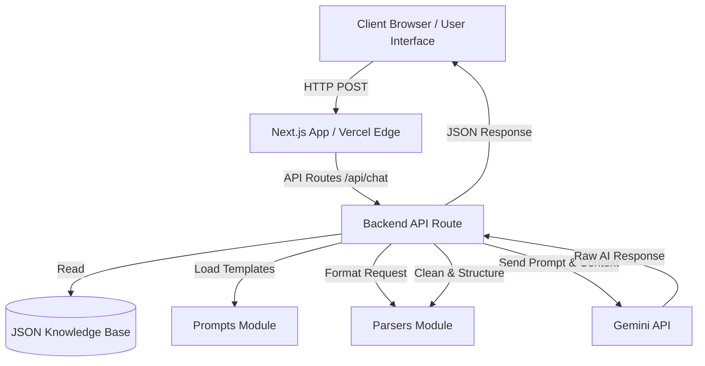
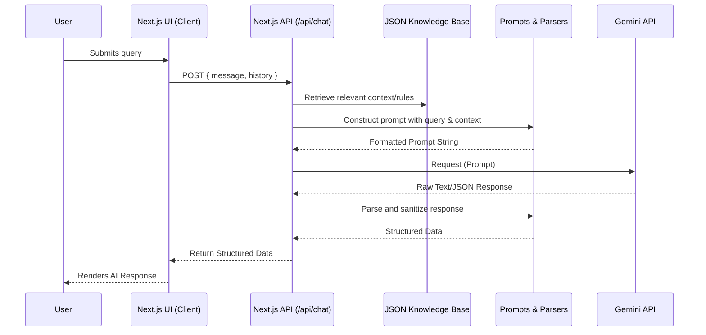

# MataTabi-AI Architecture Document

## 1. Folder Responsibilities

```text
project/
├── app/             # Next.js App Router directory. Contains UI pages, layout components, and backend API routes.
├── prompts/         # Centralized repository for Gemini API system prompts, templates, and persona definitions.
├── parsers/         # Utility functions for parsing user input, structuring Gemini API requests, and formatting the AI's responses.
├── docs/            # Project documentation directory.
│   ├── PRD.md       # Product Requirements Document
│   └── FRD.md       # Functional Requirements Document
├── README.md        # High-level overview, setup instructions, and deployment guidelines.
└── requirements.txt # Dependency definitions (Typically package.json for Next.js/JS projects, but included as per requirements for potential python-based parsing/utility scripts).
```

## 2. System Architecture Diagram



## 3. Request Flow Diagram



## 4. Component Design

*   **Frontend (UI Components)**
    *   `ChatInterface`: The main container managing the chat state, input field, and rendering the message list.
    *   `MessageBubble`: A reusable component to render individual messages (distinguishing between User and AI avatars/styling).
    *   `TypingIndicator`: Visual feedback component displayed while waiting for the API route to respond.
*   **Backend (Server Components / Utilities)**
    *   `Chat Controller` (`app/api/chat/route.js`): The primary orchestrator handling incoming requests, fetching data, and calling Gemini.
    *   `Gemini Client Service`: A wrapper function/class handling the initialization of the Gemini SDK and execution of the `generateContent` method.

## 5. Knowledge Base Design

*   **Storage**: Static JSON file(s) stored locally in the project (e.g., `data/knowledge.json`).
*   **Structure**: Grouped by intent or domain to allow for easy context extraction.
    ```json
    {
      "system_rules": {
        "persona": "You are MataTabi-AI, a helpful assistant...",
        "restrictions": ["Do not answer questions outside of your domain."]
      },
      "faq": [
        { "question": "What is MataTabi?", "answer": "MataTabi is..." }
      ]
    }
    ```
*   **Integration**: Loaded synchronously or asynchronously by the Next.js API route during the request lifecycle to inject dynamic context into the Gemini prompt.

## 6. Prompt Management Strategy

*   **Centralization**: All prompts reside in the `/prompts` folder to separate logic from content.
*   **Dynamic Injection**: Use JavaScript template literals or builder functions to inject user input and JSON KB data dynamically.
    ```javascript
    // prompts/builder.js
    export const buildSystemPrompt = (knowledgeBaseContext, userHistory) => {
      return `
        System Rules: ${knowledgeBaseContext.system_rules.persona}
        Context: ${knowledgeBaseContext.faq}
        History: ${userHistory}
      `;
    };
    ```

## 7. Session Management Design

*   **Stateless Server**: Since the application is hosted on Vercel (serverless environments), the backend will not store session state in memory.
*   **Client-Side State**: The Next.js frontend will maintain the conversational history using React state (`useState` or Context API).
*   **Payload Transmission**: Every API request will send the recent conversation history along with the new message, allowing the Gemini API to maintain conversational context without backend session storage.

## 8. API Route Design

*   **Path**: `POST /api/chat`
*   **Process**:
    1.  **Validation**: Parse the incoming request body for the `message` and `history`.
    2.  **Context Retrieval**: Read the JSON Knowledge Base.
    3.  **Prompt Assembly**: Pass the `message`, `history`, and JSON context to the `/prompts` builder.
    4.  **AI Invocation**: Send the finalized prompt to the Gemini API using the official SDK.
    5.  **Parsing**: Pass the Gemini response through the `/parsers` module to ensure it meets the required frontend format (e.g., stripping markdown, ensuring JSON structure).
    6.  **Response**: Return a `200 OK` HTTP response with the parsed data to the client.
